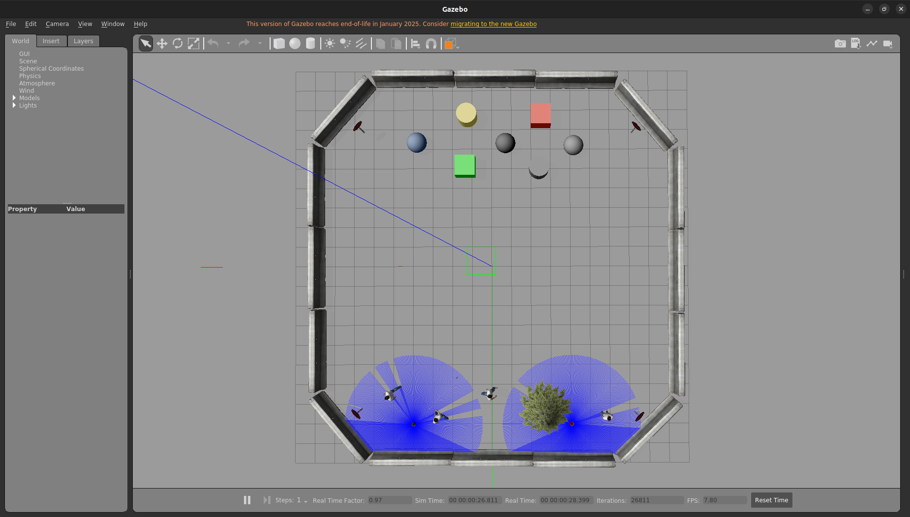
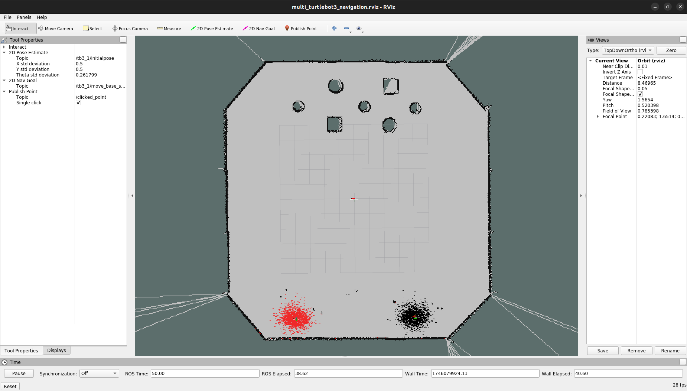

# **What Is This?**
This repository allows users to run 2 virtual TurtleBot3 Burgers in a Gazebo Simulation with motion planning available for both. 

## **Dependencies**
- Ubuntu 20.04 Focal 
- ROS 1 Noetic
- Gazebo 11

## **Build** 

1. **Download** repository:

```bash
cd $HOME
```

```bash
git clone https://github.com/cardboardcode/Multi-Robot-Gazebo-NaviStack.git --depth 1 --single-branch --branch main && cd Multi-Robot-Gazebo-NaviStack
```

2. **Build** docker image:

```bash
bash scripts/1_build_docker_image.bash
```

## **Run**

**Run** docker container:

```bash
bash scripts/2_build_docker_containter.bash
```

## **Verify** ✅






